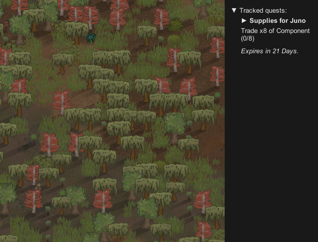

# RimworldQuestTracker

## Description

RimworldQuestTracker is a mod for RimWorld designed to improve the quest management experience by providing a quest tracking system, like for example quest trackers in MMO games. Mod enhances visibility into your active and offers more refined quest information, making colony management smoother.

## Key Features

- **Comprehensive Quest Support**: Supports a wide range of quest types, ensuring compatibility with most in-game scenarios.
- **Quest Filtering**: Automatically skips hidden quests and those dismissed by the player, keeping your tracker concise and focused.
- **Enhanced Quest Display**:
  - Displays detailed quest info, including requested items and owned/requested counters for trade requests.
  - Multiline labels with word wrap enabled for better readability.
  - Proper handling of quests without labels, showing time-left information.
  - Completed or failed quests are promptly removed from the tracker.
- **Improved UI Functionality**:
  - Reversible quest order to match in-game quest log order.
  - Foldable and draggable tracker window for better customization.
  - Consistent color adjustments to improve visibility.
- **Time Display Customization**: Displays quest timers with hours, offering different visual cues based on the remaining time.

## Development and Contributions

Mod is no longer maintained or developed. It was being developed just as Anomaly expansion was released, which broke too many things at once.
Unfortunalety I no longer have time to once again research and reverse engineer RimWorld so this mod will stay in limbo.

## License

Licensed under the MIT License.
